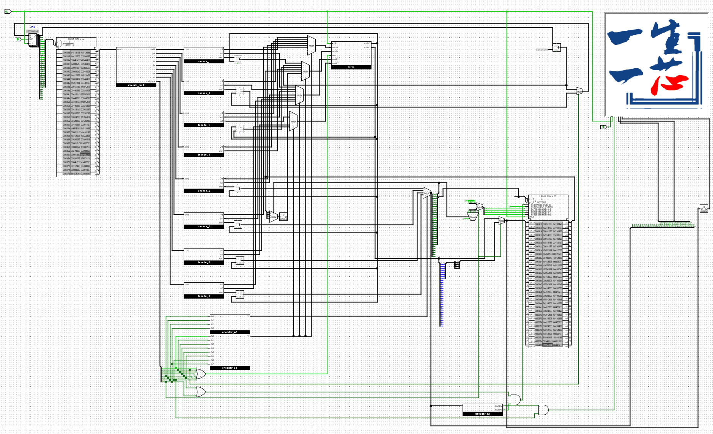

# MiniRV Single-Cycle CPU (Logisim)
A minimal 32-bit RISC-V (MiniRV) single-cycle CPU implemented in Logisim.  
Completed as part of the **一生一芯 (ysyx)** program through self-study of computer architecture.

## Overview
This project implements a complete single-cycle RISC-V processor from scratch, including:
- Control unit for branch, memory, and arithmetic instructions
- Support for the core MiniRV instruction set
- Clear modular circuit design in Logisim

## Key Components
- Instruction Fetch (PC + Instruction Memory)
- Register File
- Control Unit (opcode decoding)
- Data Memory (load/store)
- Single-cycle clocking scheme

## Instructions Implemented
- Arithmetic: add, addi, lui
- Memory: lw, sw, lbu, sb
- Jump: jalr

## How to Run
1. Open `minirv_single_cycle.circ` in Logisim
2. Load `/logisim-bin/*.hex` into RAM and ROM
3. Run simulation (auto-clock or step mode)
4. Verify register/memory results